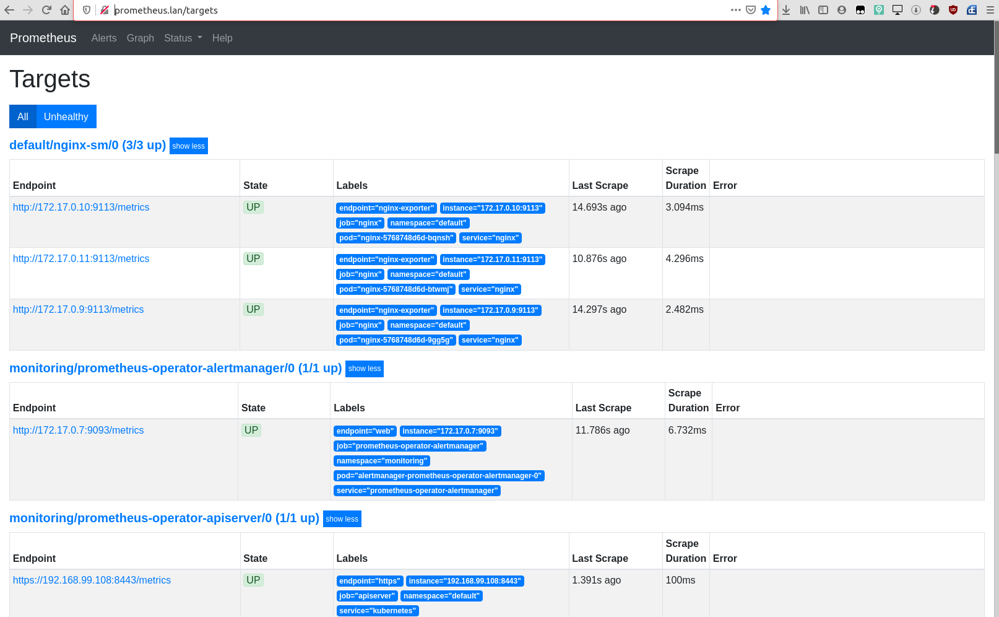
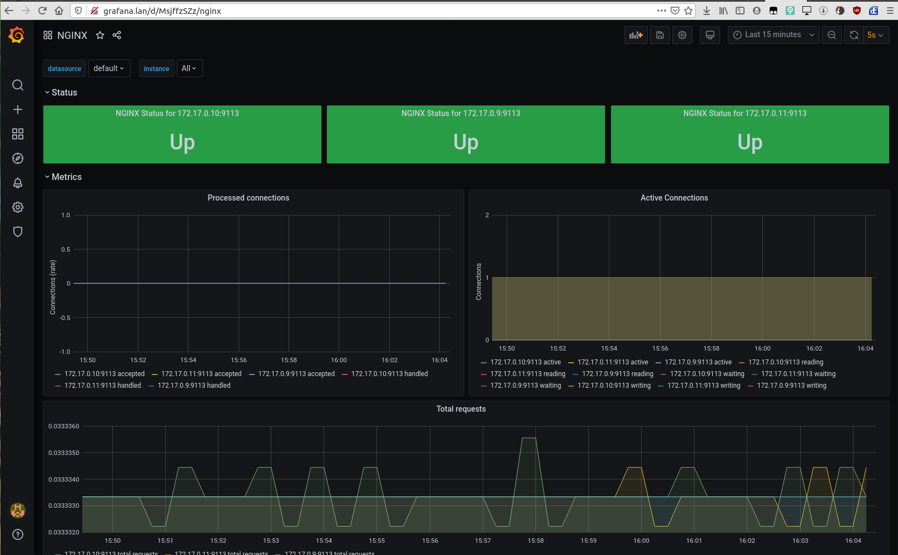

# kernel21_platform
kernel21 Platform repository

## Домашняя работа 1 (kubernetes-intro)

**При выполении работы сделано:**

- Изучен процесс устновки minikube (плагины virtualbox, kvm2, none, docker) и kind.
- Выяснены причинины восстановления подов после удаления. Coredns восстанавливается с помощью ReplicationController, остальные являются static pod'ами и восстанавливаются системной службой kublet (конфигуарции находятся в /etc/kubernetes/manifests).
- Собран и запушен на docker hub образ согласно заданию. Создан yaml для pod с init контейнером.
- Получен файл конфигурации hipster shop frontend, в результате аналига логов файл пофикшен и является рабочим.

## Домашняя работа 2 (kubernetes-controllers)

**При выполении работы сделано:**

- Запущен kind
~~~~~~
kind create cluster --config kind-config.yaml
~~~~~~
- Был создан ReplicaSet, Deployment для сервисов frontend, paymentservice.
- **Почему обновление ReplicaSet не повлекло обновление запущенных pod ?**  Replicaset не умеет обновлять template контейнеров.
- С использованием параметров maxSurge и maxUnavailable были реализованы сценарии развертывания blue-green и Reverse Rolling Update.
- Был изучен и проверен механиз корректности работы pod с помощью readinessProbe и livenessProbe.
- Был применен yaml c DaemonSet для node-exporter, при этом он был развернут всех нодах кластера. Было выяснено, что на развертывание на мастер-нодах влияет параметр tolerations.

## Домашняя работа 3 (kubernetes-controllers)

**При выполении работы сделано:**

- Создан Service Account bob, ему дана ему роль admin в рамках всего кластера
- Создать Service Account dave без доступа к кластеру.
- Создан Namespace prometheus
- Создан Service Account carol в namespace prometheus
- Всем Service Account в Namespace prometheus дана возможность делать get, list, watch для pods всего кластера
- Создан Namespace dev
- Создан Service Account jane в Namespace dev
- jane дана роль admin в рамках Namespace dev
- Создан Service Account ken в Namespace dev
- ken дана роль view в рамках Namespace dev

## Домашняя работа 4 (kubernetes-networks)

**При выполении работы сделано:**

- Добавлены проверки Pod (ReadinessProbe, LivenessProbe)
- Создан объект Deployment
- Добавлен сервис в кластер (ClusterIP)
- Включен режим балансировки IPVS
- Установлен MetaILB в Layer2 режиме
- Добавлен сервис LoadBalancer
- Установлен ingress-контроллер и прокси ingress-nginx
- Созданы правила Ingress

#### Вопрос:
***Почему следующая конфигурация валидна, но не имеет смысла? Бывают ли ситуации, когда она все-таки имеет смысл?***
```
                    livenessProbe:
                        exec:
                            command:
                                - 'sh'
                                - '-c'
                                - 'ps aux | grep my_web_server_process'
```
#### Ответ:
В выводе grep будет присутсвовать сама команда grep, ее можно убрать через добавление '| grep -v grep'
Но даже при этом наличие процесса не говорит о его корректной работе. Смысл имеет, если данный процесс сам будет являться результатом предварительной работы при развертывании.

## Домашняя работа 5 (kubernetes-volumes)

**При выполении работы сделано:**

- Развернут StatefulSet c minio в kind
- Создан файл секретов minio-secret.yaml и изменен minio-statefulset.yaml для использования секретов из Secret

## Домашняя работа 6 (kubernetes-templating)

**При выполении работы сделано:**

- Установлен helm 3
- Был установлен Cert-manager
- Установлен Harbor
- Рассмотрен процесс создания своего chart'a
- Рассмотрен helm secret
- Рассмотрен kubecfg
- Рассмотрен kustomize

## Домашняя работа 7 (kubernetes-operators)

- Результат выполнения:

***kubectl get jobs***:

``` 
$ kubectl get jobs

NAME                         COMPLETIONS   DURATION   AGE
backup-mysql-instance-job    1/1           1s         7m4s
restore-mysql-instance-job   1/1           3m22s      8m25s
```

- Результат выполнения:

***$ export MYSQLPOD=$(kubectl get pods -l app=mysql-instance -o jsonpath="
{.items[*].metadata.name}")***

***$ kubectl exec -it $MYSQLPOD -- mysql -potuspassword -e "select * from test;" otus-database***

```
mysql: [Warning] Using a password on the command line interface can be insecure.
+----+-------------+
| id | name        |
+----+-------------+
|  1 | some data   |
|  2 | some data-2 |
+----+-------------+
```

## Домашняя работа 8 (kubernetes-monitoring)

- Создаем новый ns и разворачиваем prometheus-operator через helm3 с values для ingress:
```
kubectl create ns monitoring
helm upgrade --install  prometheus-operator stable/prometheus-operator -n monitoring -f prometheus-operator.values.yaml
```
- Ждем старта всех pods
```
kubectl get pods -n monitoring
NAME                                                      READY   STATUS    RESTARTS   AGE
alertmanager-prometheus-operator-alertmanager-0           2/2     Running   0          45s
prometheus-operator-grafana-7769fc4f77-lq28g              2/2     Running   0          72s
prometheus-operator-kube-state-metrics-69fcc8d48c-9gvmd   1/1     Running   0          72s
prometheus-operator-operator-5cf9888d76-szdxf             2/2     Running   0          72s
prometheus-operator-prometheus-node-exporter-s2j65        1/1     Running   0          72s
prometheus-prometheus-operator-prometheus-0               3/3     Running   1          35s

```
- Разворачиваем:
1. ConfigMap с конфигурацией nginx.
2. Deployment с nginx и sidecar nginx-exporter контейнерами:
  * nginx с 80 портом с поддержкой nginx-статуса доступного на порту 8080 по адресу http://127.0.0.1:8080/basic_status
  * nginx-exporter, отдающий метрики в формате prometheus на порту 9113
  * три реплики
3. Service для доступа к pods.
4. CR ServiceMonitor для мониторинга сервисов.

```
kubectl apply -f nginx-configMap.yaml
kubectl apply -f nginx-deployment.yaml
kubectl apply -f nginx-nginx-service.yaml
kubectl apply -f nginx-serviceMonitor.yaml
```
- Получаем пароль для grafana
```
kubectl get secret -n monitoring prometheus-operator-grafana -o yaml
apiVersion: v1
data:
  admin-password: cHJvbS1vcGVyYXRvcg==
  admin-user: YWRtaW4=
  ldap-toml: ""
----
```
```
$echo "YWRtaW4=" | base64 -d
admin
$echo "cHJvbS1vcGVyYXRvcg==" | base64 -d
prom-operator
```

- Заходим на http://prometheus.lan/targets

- Заходим на http://grafana.lan, импортируем dashboard.json для nginx prometheus exporter


